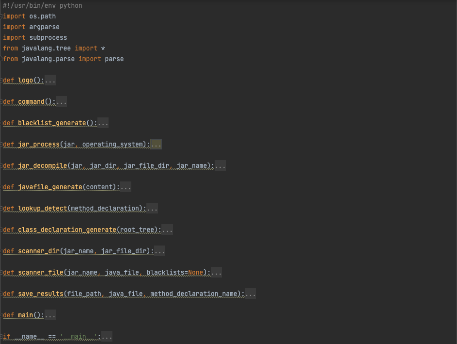
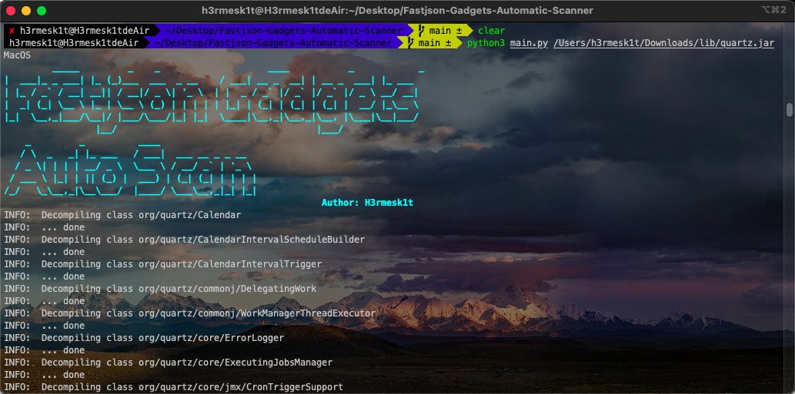
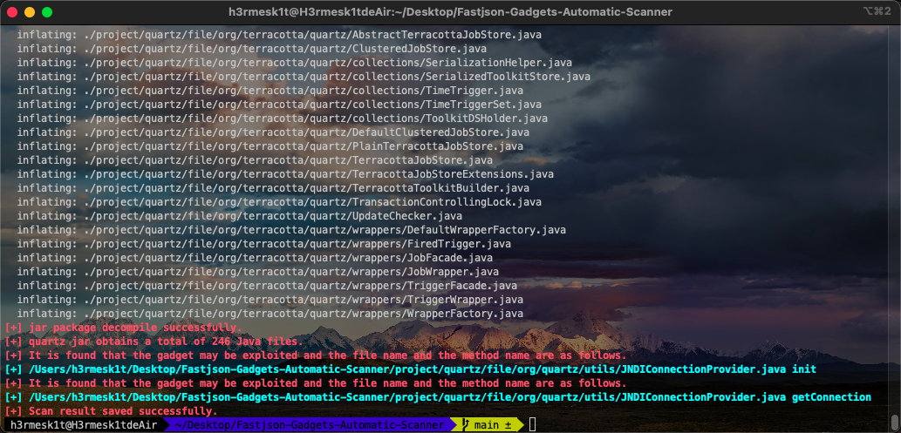

# Fastjson-Gadgets-Automatic-Scanner

## Introduction

In computer science, an Abstract Syntax Tree (AST), or simply a [Syntax](https://baike.baidu.com/item/语法树/7031301)tree, is an abstract representation of the [grammatical structure of ](https://baike.baidu.com/item/语法)[source code . ](https://baike.baidu.com/item/源代码)[It represents the syntax structure of the programming language](https://baike.baidu.com/item/编程语言) in the form of a tree, and each node on the tree represents a structure in the source code.

This project combines Abstract Syntax Tree (AST) to automatically scan fastjson available ga
dgets in a jar package.


## Fastjson Vulnerability

[Fastjson](https://github.com/alibaba/fastjson/wiki) is a Java library that can be used to convert Java Objects into their JSON representation. It can also be used to convert a JSON string to an equivalent Java object. Fastjson can work with arbitrary Java objects including pre-existing objects that you do not have source-code of.

When fastjson is deserialized, it will execute the constructor of the target class、the method starts with "set" or "get". And due to the characteristic of deserialization, we can make use of the target class that method starts with "set" to freely set the attribute value of the class. What's more, it is easy to cause Remote Code Execution (RCE).

There are two types for defense in lower versions:
 - Add autoType setting to configure whether to allow to deserialize any class which is disables by default.
 - Add blacklist check mechanism, all classes in the blacklist are not allowed to deserialize.

Combining the two defensive methods, theoretically, when the autoType setting is turned on, we can find class that not in fastjson blacklist with a jar package to construct available gadgets.

## Project Logic
According to the above description, we can roughly describe the logic of the project.
 - Decompiling the jar package that classes are not in the fastjson blacklist, and generate Java source files.
 - Generating Abstract Syntax Tree based on Java source files.
 - Conditionally judge the syntax tree and filter out the classes that meet the conditions.
 - According to the filtering results, try to construct the POC.



## Usage

```shell
usage: python main.py [-h] jar operating_system

positional arguments:
  jar               Enter the jar to be scanned
  operating_system  Enter the operating system Windows or Linux or MacOS

optional arguments:
  -h, --help        show this help message and exit
```





## Finally
In particular, this project is limited to mining Gadgets that may be exploited, and screening results need to be excluded by themselves.

